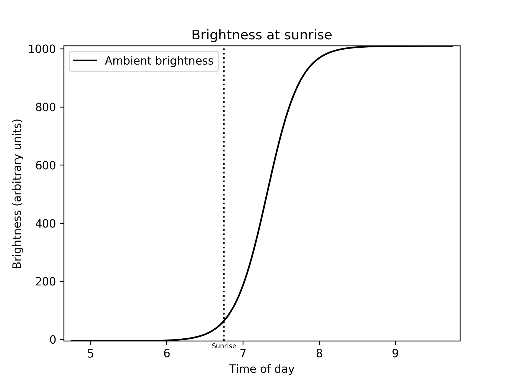
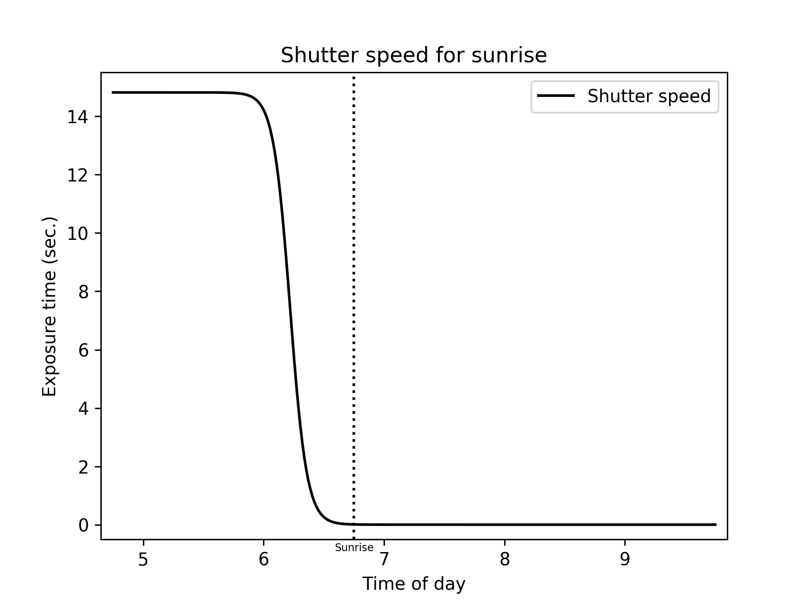
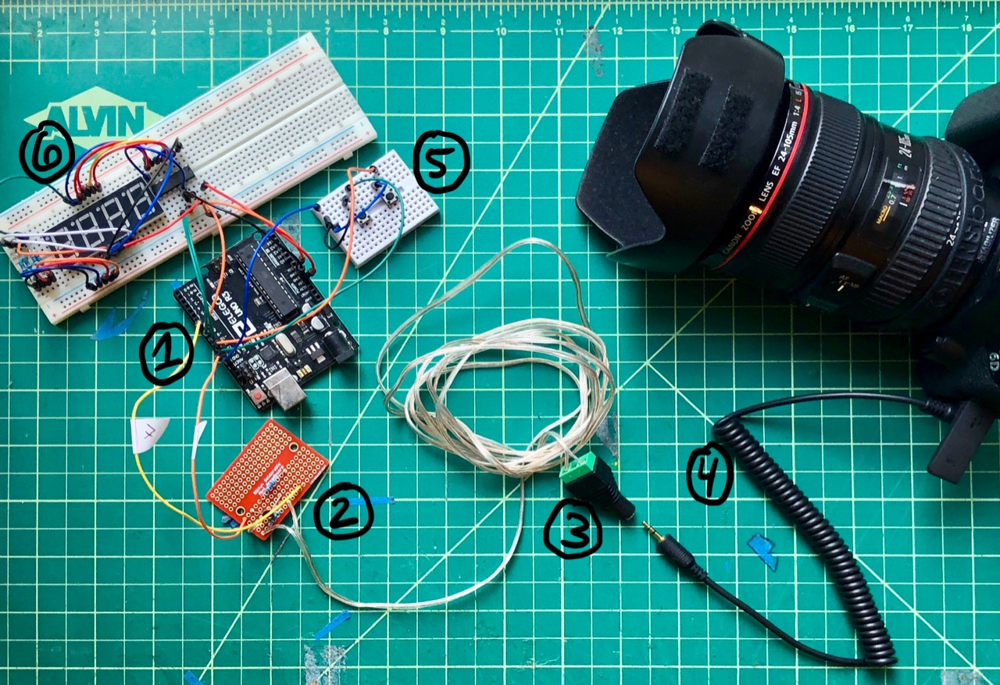
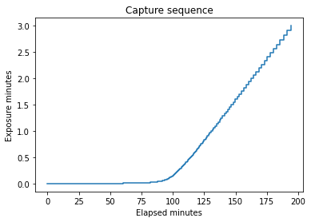
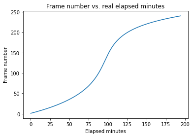
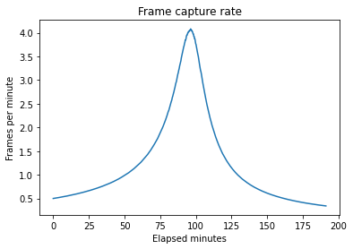
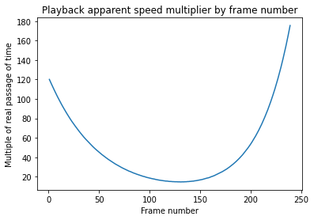

# Shutter Controller

## Introduction
I have long appreciated the art of making timelapses. They can reveal motion in the world on timescales that are not normally noticeable like clouds forming and evaporating in the sky or the Earth rotating against the stars. In theory, timelapses are simple enough to create: one simply takes a sequence of images and stitches them together into the frames of a movie using free software. However in practice I have found them tricky to make well.

## Exposure problem
The ambient brightness of the environments I want to capture will be continuously changing. Since I'm looking to produce timelapses with a roughly constant apparent brightness, I can't use the manual mode on my camera as it won't adapt:
<p align="center">
  
    <p align="center">
   Manual mode
</p>
</p>
</br>
Automatic exposure (AE) mode isn't an option either because it causes the frames to flicker:
</br>
<p align="center">
  
  <p align="center">
   AE mode
</p>
</p>

## Nonlinearity of the problem
The ambient brightness throughout sunrise and sunset does not follow a straight line with respect to time. Instead, it forms a logistic curve:
<p align="center">
  
  <p align="center">
   Brightness with respect to time inferred from real-world data
</p>
</p>
</br>
To shoot well-exposed timelapses around these times I will compensate by using a complimentary shutter speed curve, one that decays as the brightness increases and vice-versa:
<p align="center">
  
  <p align="center">
   Shutter speeds needed to maintain a constant image brightness (range of ~15s to ~1/320s)
</p>
</p>

## Intervalometers
Certain intervalometers offer the possibility of varying the shutter speed during the capture sequence, but none offer enough control over how the shutter speed changes. I have only seen models that interpolate linearly between given starting and ending speeds, which is too slow for this purpose.

## Custom control
I chose to build my own shutter release circuit as it can be operated programmatically via an Arduino microcontroller:
<p align="center">
  
  <p align="center">
   (1) Arduino, (2) shutter release circuit, (3) 2.5mm TRS post adapter, (4) 2.5mm shutter cable, (5) interface, (6) 7-segment display
</p>
</p>
</br>

```python
import numpy as np
import matplotlib.pyplot as plt
import pandas as pd
```


```python
def times100(start_speed,end_speed,number_frames):
  speeds = np.logspace(start=np.log(start_speed),stop=np.log(end_speed),num=number_frames,base=np.e) # assumes inputs in ms
  std_speeds = np.ceil((speeds-1.0) / 100.0).astype(int) * 100 # round to nearest 100 ms
  return std_speeds
```


```python
 num_frames = 240
```


```python
shutters = times100(100,180000,num_frames)
```


```python
pauses = times100(120000,1000,num_frames-1)
print("Total time paused =", round(np.sum(pauses)/60000,1), "minutes")
```

    Total time paused = 99.8 minutes


```python
total_hrs = (np.sum(shutters) + np.sum(pauses)) / 1000 / 3600
print("Total capture period =", int(np.floor(total_hrs)), "Hrs, ", int((total_hrs - np.floor(total_hrs) ) * 60),"Mins")
# print("Start sequence", np.round(60 * np.cumsum(shutters)[0] / 1000 / 3600) , "mins before sunset")
```

    Total capture period = 3 Hrs,  17 Mins


```python
rec_time = np.sum(shutters) / 3600000
print("Total light gathering time =", int(np.floor(rec_time)), "Hrs, ", int((rec_time - np.floor(rec_time) ) * 60),"Mins")
```

    Total light gathering time = 1 Hrs,  37 Mins


```python
print("Video playback length @ 30p =", round(num_frames/30,1), "seconds")
```

    Video playback length @ 30p = 8.0 seconds


```python
shutters
```


    array([   100,    200,    200,    200,    200,    200,    200,    200,
              200,    200,    200,    200,    200,    200,    200,    200,
              200,    200,    200,    200,    200,    200,    200,    300,
              300,    300,    300,    300,    300,    300,    300,    300,
              300,    300,    300,    300,    400,    400,    400,    400,
              400,    400,    400,    400,    400,    500,    500,    500,
              500,    500,    500,    500,    600,    600,    600,    600,
              600,    600,    700,    700,    700,    700,    700,    800,
              800,    800,    800,    900,    900,    900,    900,   1000,
             1000,   1000,   1100,   1100,   1100,   1200,   1200,   1200,
             1300,   1300,   1400,   1400,   1400,   1500,   1500,   1600,
             1600,   1700,   1700,   1800,   1800,   1900,   2000,   2000,
             2100,   2100,   2200,   2300,   2400,   2400,   2500,   2600,
             2700,   2700,   2800,   2900,   3000,   3100,   3200,   3300,
             3400,   3500,   3600,   3700,   3900,   4000,   4100,   4200,
             4400,   4500,   4600,   4800,   4900,   5100,   5300,   5400,
             5600,   5800,   5900,   6100,   6300,   6500,   6700,   6900,
             7200,   7400,   7600,   7900,   8100,   8400,   8600,   8900,
             9200,   9500,   9800,  10100,  10400,  10800,  11100,  11400,
            11800,  12200,  12600,  13000,  13400,  13800,  14200,  14700,
            15200,  15600,  16100,  16600,  17200,  17700,  18300,  18900,
            19500,  20100,  20700,  21400,  22100,  22800,  23500,  24200,
            25000,  25800,  26600,  27500,  28300,  29200,  30200,  31100,
            32100,  33100,  34200,  35300,  36400,  37600,  38800,  40000,
            41300,  42600,  43900,  45300,  46800,  48300,  49800,  51400,
            53000,  54700,  56500,  58300,  60100,  62000,  64000,  66000,
            68100,  70300,  72500,  74800,  77200,  79700,  82200,  84800,
            87500,  90300,  93200,  96200,  99200, 102400, 105700, 109000,
           112500, 116100, 119800, 123600, 127500, 131600, 135800, 140100,
           144600, 149200, 153900, 158800, 163900, 169100, 174500, 180000])


```python
pauses
```


    array([120000, 117700, 115300, 113000, 110800, 108600, 106400, 104300,
           102200, 100200,  98200,  96200,  94300,  92400,  90600,  88800,
            87000,  85300,  83600,  81900,  80300,  78700,  77100,  75600,
            74100,  72600,  71200,  69800,  68400,  67000,  65700,  64400,
            63100,  61800,  60600,  59400,  58200,  57100,  55900,  54800,
            53700,  52700,  51600,  50600,  49600,  48600,  47600,  46700,
            45700,  44800,  43900,  43100,  42200,  41400,  40500,  39700,
            39000,  38200,  37400,  36700,  35900,  35200,  34500,  33800,
            33200,  32500,  31900,  31200,  30600,  30000,  29400,  28800,
            28200,  27700,  27100,  26600,  26100,  25500,  25000,  24500,
            24100,  23600,  23100,  22600,  22200,  21800,  21300,  20900,
            20500,  20100,  19700,  19300,  18900,  18500,  18200,  17800,
            17400,  17100,  16800,  16400,  16100,  15800,  15500,  15200,
            14900,  14600,  14300,  14000,  13700,  13400,  13200,  12900,
            12700,  12400,  12200,  11900,  11700,  11500,  11200,  11000,
            10800,  10600,  10400,  10200,  10000,   9800,   9600,   9400,
             9200,   9000,   8800,   8700,   8500,   8300,   8200,   8000,
             7800,   7700,   7500,   7400,   7200,   7100,   6900,   6800,
             6700,   6500,   6400,   6300,   6200,   6000,   5900,   5800,
             5700,   5600,   5500,   5400,   5300,   5100,   5000,   4900,
             4900,   4800,   4700,   4600,   4500,   4400,   4300,   4200,
             4100,   4100,   4000,   3900,   3800,   3700,   3700,   3600,
             3500,   3500,   3400,   3300,   3300,   3200,   3100,   3100,
             3000,   3000,   2900,   2800,   2800,   2700,   2700,   2600,
             2600,   2500,   2500,   2400,   2400,   2300,   2300,   2200,
             2200,   2200,   2100,   2100,   2000,   2000,   2000,   1900,
             1900,   1800,   1800,   1800,   1700,   1700,   1700,   1600,
             1600,   1600,   1500,   1500,   1500,   1500,   1400,   1400,
             1400,   1300,   1300,   1300,   1300,   1200,   1200,   1200,
             1200,   1200,   1100,   1100,   1100,   1100,   1000])


```python
frames_start_mins = [0] + [(np.cumsum(shutters)[x] + np.cumsum(pauses)[x]) / 60000 for x in range(len(pauses))]

plt.step(frames_start_mins,shutters/60000,where='post')
plt.title("Capture sequence")
plt.xlabel("Elapsed minutes")
plt.ylabel("Exposure minutes");
```


    

    


```python
plt.plot(frames_start_mins, np.arange(1,num_frames+1))
plt.title("Frame number vs. real elapsed minutes")
plt.xlabel("Elapsed minutes")
plt.ylabel("Frame number");
```


    

    


```python
interval_minutes = np.diff(frames_start_mins)*60

plt.plot(frames_start_mins[:-1],60/interval_minutes)
plt.title("Frame capture rate")
plt.xlabel("Elapsed minutes")
plt.ylabel("Frames per minute");
```


    

    


```python
plt.plot(np.arange(1,num_frames),interval_minutes)
plt.title("Playback apparent speed multiplier by frame number")
plt.xlabel("Frame number")
plt.ylabel("Multiple of real passage of time");
```


    

    


```python
df = pd.DataFrame(zip(frames_start_mins[:-1],60/interval_minutes),columns=["StartFrameMinute","CaptureRatePerMinute"])
```


```python
print("Peak capture rate is",round(df["StartFrameMinute"][df.idxmax(axis=0)["CaptureRatePerMinute"]]),"minutes into recording.")
```

    Peak capture rate is 96 minutes into recording.


```python
len(pauses)==len(shutters)-1
```


    True


```python

```

